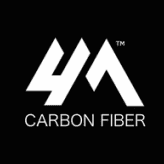

# scrapecrunch
scrape crunchbase

Wrote a script to scrape data for name, about company, location, company size, company website, when it was founded 
unding received, relevant industries, legal name, link to financial data, and social media. The script also fetches
the logo of the company and saves it as a .png files as bellow:

| Name | About | Location  | Size | Website | Year Founded | Funding |
| --- | --- | --- | --- |--- |--- |---|
| 4M Carbon Fiber | 4M Carbon Fiber is deploying its patented and proven low-cost carbon fiber technology. | Knoxville | 11-50 | 4mio.com/ | 2015 |  $4M |

| Industry | 
| --- | 
| Industrial |
| Information Technology |
| Machinery Manufacturing |

| Legal Name | Email | Phone #  | 
| --- | --- | --- | --- |--- |--- |---|
| 4M Carbon Fiber Corp. | info@4mio.com | (865) 444-6789 |

| Social Media |
| --- | 
| https://www.linkedin.com/company/4m-industrial-oxidation/?originalSubdomain=in| 
| https://twitter.com/4mcarbonfiber?lang=en | 

| Transaction | Date | Timestamp |
| --- | --- | --- |
| Venture Round| Apr 1, 2018 | timestamp = 1522533600.0 | 

